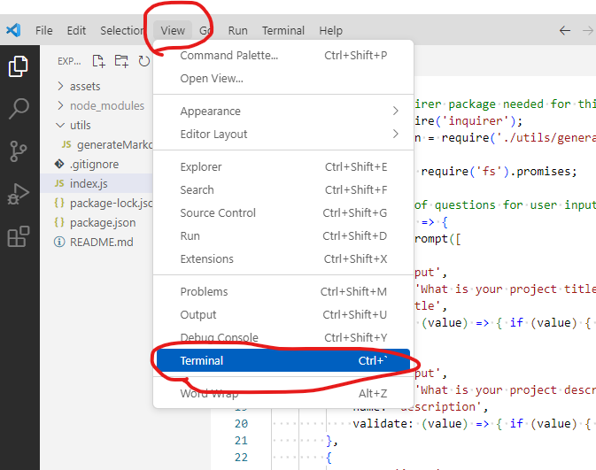

# README Generator

## Description

This is a command-line application that dynamically generates a professional README.md file for a user's input using the Inquirer package. 

When creating an open-source project on GitHub, it’s important to have a high-quality README for the app. This should include what the app is for, how to use the app, how to install it, how to report issues, and how to make contributions. 

## Installation

The user will need to install the inquirer package in order to use this application. Please use "npm i inquirer@8.2.4". 

## Usage

To use the README Generator Application, you will need to clone this GitHub repo to your local machine and open it in VS Code. 

You will then need to open the terminal in VS Code. To do that, simply click on "View", and then click on "Terminal". Once in the terminal, you should already be inside the application folder. If not, please follow the below instructions. 

In the terminal, go into the folder that you are currently in. To do that, type "cd " and then the location of the folder. For example, if the application folder is inside the "Documents" folder, simply type in "cd Documents" and then "cd README Generator". 

Once in the correct folder, enter "node index.js". This will initiate the questions prompts for you to enter all the details required for a professional README.md file. 

Below is a screenshot of how to open the terminal in VS Code:

Below is a link to a walkthrough video to assist with how to use the application:
[Click here for the walkthrough video]( https://drive.google.com/file/d/1aMU7cN8cAIz_Bstxsr0-7BjRGD3RcYjD/view)

## Credits

Coding Bootcamp by USYD x EDX

## License

Please refer to the LICENSE in the repo.

## Contacts

* GitHub: https://github.com/miloyang
* Email: miloyang9@gmail.com
